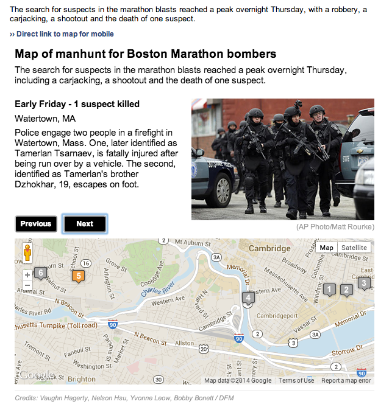

boston-manhunt-app
==================

What is this?
-------------

Google map and images showing series of events in hunt for Boston Marathon bombers. Fed via Google spreadsheet.

Live demo: http://www.elpasotimes.com/newupdated/ci_23062944/map-manhunt-boston-marathon-bombing-suspects

Credits
---------

Vaughn Hagerty, Nelson Hsu, Yvonne Leow, Bobby Bonett
 
Assumptions
-----------

* Google maps
* handlebars.js
* jQuery

What's in here?
---------------

The project contains the following folders and important files:

* ``index.html`` -- The app html
* ``lib/js`` -- Javascript
* ``lib/css`` -- Strangely enough, stylesheets
* ``lib/images`` -- pics and map markers

License
----------

This code is available under the MIT license. For more information, please see the LICENSE file in this repo.
